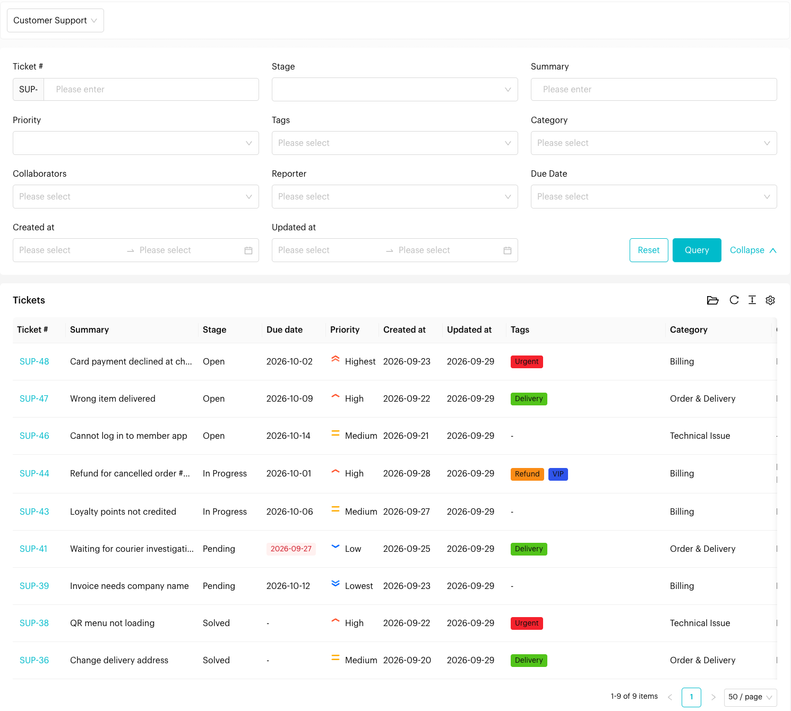
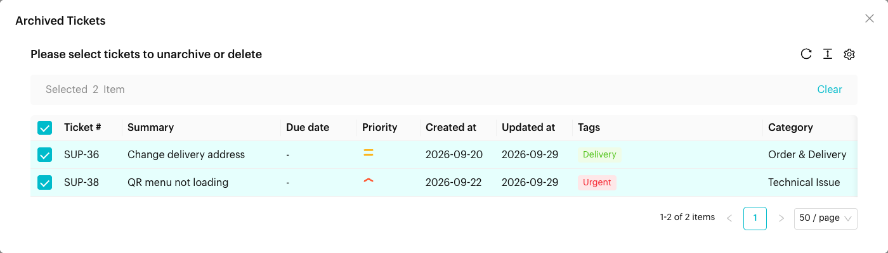

# Tickets: List

## What is the Tickets List?
The List view shows all tickets in a pipeline in a single table. It is the best view for detailed searching, sorting and reviewing many tickets at once.

Open it from `Tickets` > `List` in the left menu, then choose a pipeline at the top.

<figure><figcaption>
Tickets List
</figcaption></figure>

Click **Collapse** to hide the filter panel.

## Using the List View

### Filtering
Use the filter panel above the table, then click **Query**. Click **Reset** to clear all filters.

| Filter | Use it to find |
| --- | --- |
| **Ticket #** | A specific ticket. The pipeline key is filled in for you, so type only the number, e.g. `12` for `SUP-12`. |
| **Summary** | Tickets with words in the summary |
| **Stage** | Tickets in one stage |
| **Priority** | *Highest*, *High*, *Medium*, *Low*, *Lowest* or *Not set* |
| **Tags** | Tickets with a tag |
| **Category** | Tickets in a category, e.g. *Billing* |
| **Collaborators** | Tickets a team member works on |
| **Reporter** | Tickets raised by a team member |
| **Due Date** | *With due date*, *Overdue*, *Due within 1 week*, *Due within 1 month* or *Due within this month* |
| **Created at / Updated at** | Tickets created or changed between two dates |

### Viewing Ticket Data
Each row is a ticket. Click the ticket number to open the [ticket form](./board.md#the-ticket-form).

| Column | Description |
| --- | --- |
| **Ticket #** | The ticket number, e.g. `SUP-12` |
| **Summary** | The ticket title |
| **Stage** | The ticket's current stage |
| **Due date** | When the ticket is due. Overdue tickets are marked. |
| **Priority** | Priority icon. Hover for the name. |
| **Created at / Updated at** | When the ticket was created and last changed. Hover for the exact time. |
| **Tags** | Tags on the ticket |
| **Category** | The ticket's category |
| **Collaborators** | Team members working on the ticket |
| **Reporter** | Who raised the ticket |

Use the page size selector at the bottom to show up to 500 tickets per page.

### Archived Tickets
Click the **folder** icon above the table (*Archived Tickets*) to see tickets that were archived. Select one or more tickets, then use the buttons at the bottom right of the page:
- **Bulk Unarchive**: Put them back on the board.
- **Bulk Delete**: Permanently delete them.

<figure><figcaption>
Archived Tickets
</figcaption></figure>


Deleted tickets can't be recovered. Archive tickets instead if you might need them later.


### Opening the List from the Tickets Report
Clicking a card, chart or count in the [Tickets Report](../reports/tickets.md) opens the List in a new tab, already filtered to the tickets behind that number (for example, *tickets in Pending* or *tickets tagged Refund*). Adjust or reset the filters to broaden the list.

## When to use List vs Board?
- **Use Board** for day-to-day work and moving tickets through stages.
- **Use List** to find a specific ticket, review tickets by category, reporter or collaborator, or clean up archived tickets.
